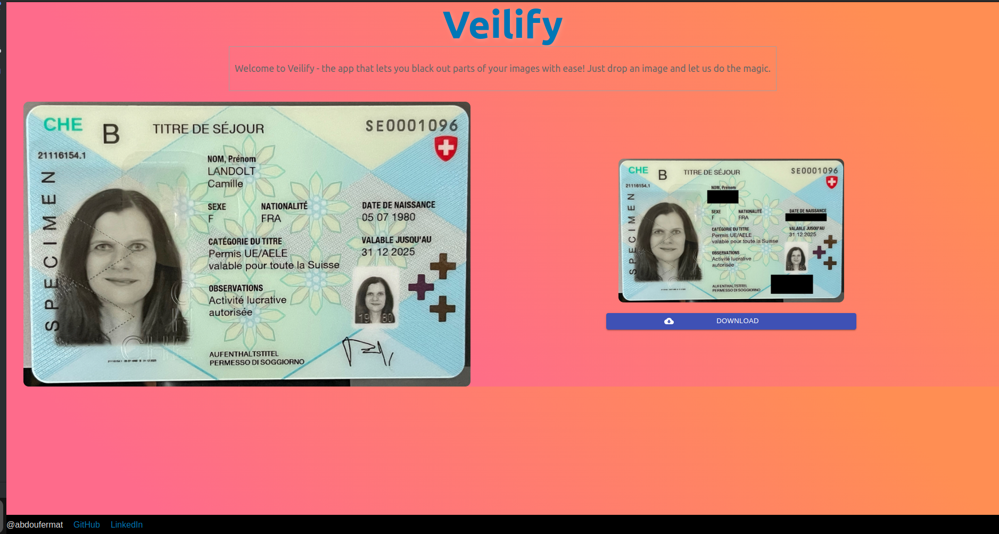

# Veilify

Veilify is a web application designed to obscure specific information in images by blacking out selected areas. This feature can be especially useful for protecting sensitive data before sharing images publicly.

## Features

- **Privacy Protection**: Easily black out sensitive information on images to protect your privacy.
- **User-Friendly Interface**: Simple and intuitive ReactJS frontend to interact with the application.
- **Fast Processing**: Built with a FastAPI backend for quick and efficient image processing.

## Demo



## Getting Started

These instructions will get you a copy of the project up and running on your local machine for development and testing purposes.

### Prerequisites

Before running Veilify on your local machine, make sure you have the following software installed:

- [Node.js](https://nodejs.org/)
- [Yarn](https://yarnpkg.com/) (optional, you could use npm which comes with Node.js)
- [Python](https://www.python.org/)
- [Pip](https://pip.pypa.io/en/stable/)

### Installation

Clone the repository to your local machine:

```bash
git clone https://github.com/abdoufermat5/veilify.git
cd veilify
```

#### Setting up the Backend

Navigate to the backend directory and install the required Python packages:

```bash
cd backend
pip install -r requirements.txt
```

To run the FastAPI server, execute:

```bash
uvicorn main:app --reload
```

The `--reload` flag enables hot reloading during development.

#### Setting up the Frontend

Navigate to the frontend directory and install the necessary Node.js packages:

```bash
cd ../client-app
npm install # or "yarn install" if you are using yarn
```

To start the React development server, run:

```bash
npm start # or "yarn start" if you are using yarn
```

Visit `http://localhost:3000` in your web browser to view the application.

## Usage

1. **Upload Image**: Use the upload feature on the web interface to select an image you wish to edit.
2. **Select Areas**: Use the mouse to select the area of the image you want to black out.
3. **Process**: Submit the image for processing, and the selected areas will be blacked out.
4. **Download**: Download the edited image with the obscured information.

## Contributing

Contributions are what make the open source community such an amazing place to learn, inspire, and create. Any contributions you make are **greatly appreciated**.

1. Fork the Project
2. Create your Feature Branch (`git checkout -b feature/AmazingFeature`)
3. Commit your Changes (`git commit -m 'Add some AmazingFeature'`)
4. Push to the Branch (`git push origin feature/AmazingFeature`)
5. Open a Pull Request

## License

Distributed under the MIT License. See `LICENSE` for more information.

## Contact

Abdoufermat - [portfolio](https://abdoufermat-5.netlify.app/)

Project Link: [https://github.com/abdoufermat5/veilify](https://github.com/abdoufermat5/veilify)

## Acknowledgements

- [ReactJS](https://reactjs.org/)
- [FastAPI](https://fastapi.tiangolo.com/)
